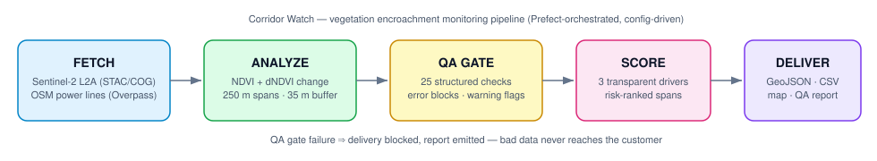
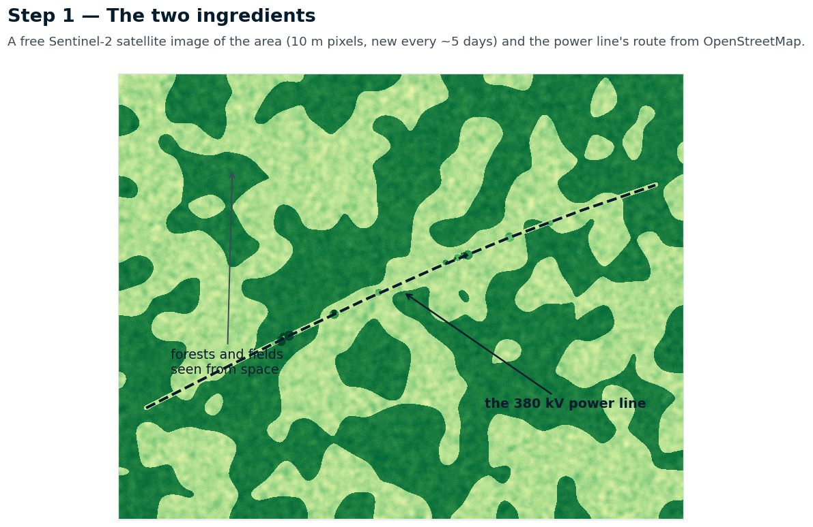
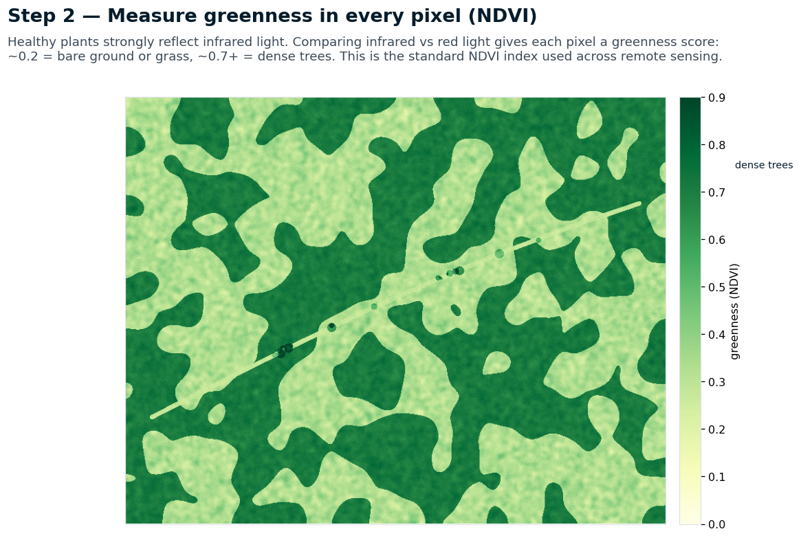
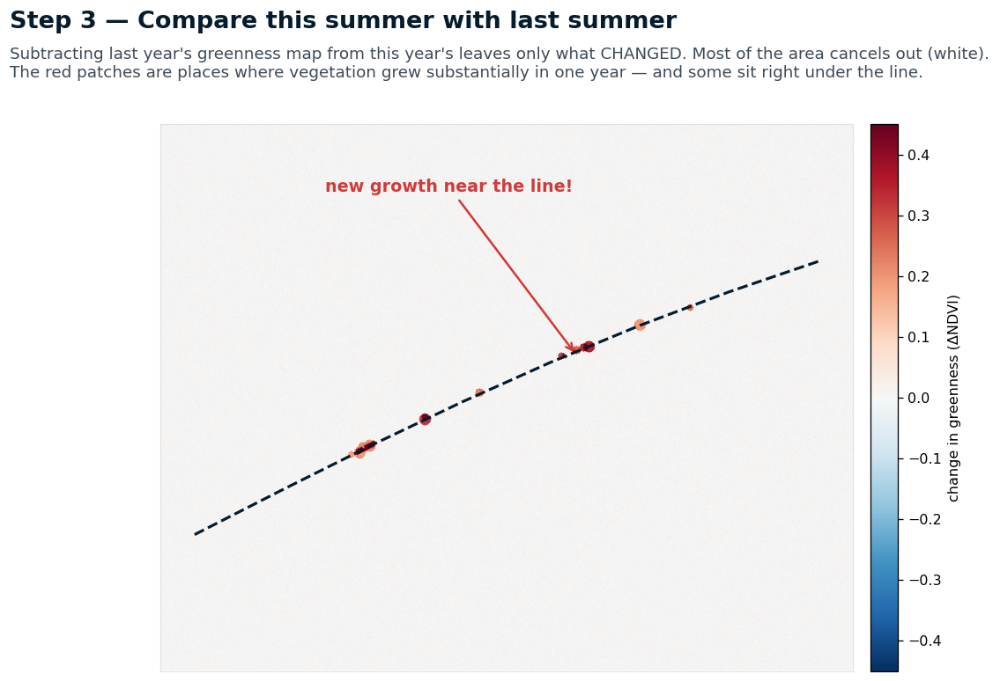
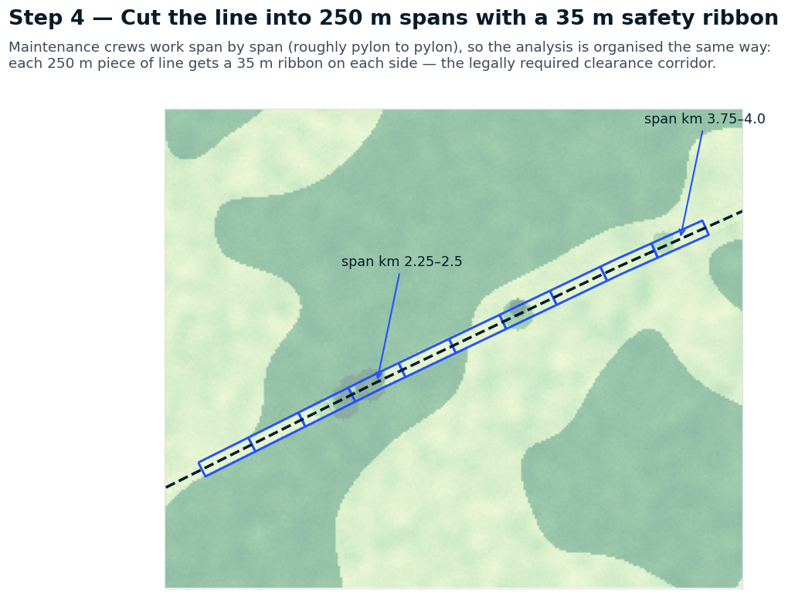
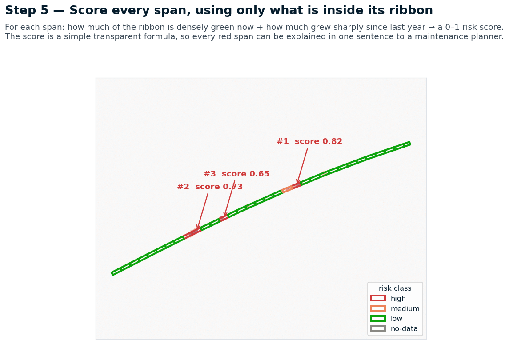
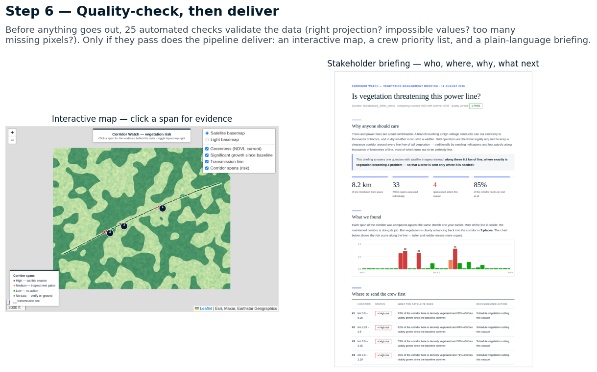

# Corridor Watch 🛰️⚡

**Satellite-based vegetation encroachment monitoring for power transmission corridors** — an end-to-end geospatial analytics pipeline built with Sentinel-2 imagery, OpenStreetMap infrastructure data, and delivery-grade quality assurance.

Vegetation growing into transmission-line clearance corridors is one of the leading causes of power outages and wildfire ignitions. Grid operators must inspect thousands of kilometres of line; satellite monitoring turns that from periodic helicopter patrols into continuous, targeted maintenance. This project implements that workflow for a 380 kV corridor in Brandenburg, Germany.



## What it does

1. **Fetch** — queries the [Earth Search STAC API](https://earth-search.aws.element84.com/v1) for cloud-free Sentinel-2 L2A scenes over the AOI (windowed COG reads: only the corridor subset is downloaded, never a full granule) and pulls `power=line` geometries ≥110 kV from OSM via Overpass.
2. **Analyze** — computes NDVI for a baseline and a monitoring epoch, differences them, segments the line into 250 m spans, buffers each span to the 35 m clearance corridor, and extracts per-span zonal statistics.
3. **QA-gate** — runs 25 structured data-quality checks (CRS conformance, nodata fraction, value ranges, degenerate rasters, geometry validity, output sanity) and **blocks the delivery** if any blocking check fails. Every run emits a machine-readable JSON + human-readable Markdown QA report.
4. **Score & deliver** — combines three interpretable drivers (current dense-vegetation fraction, 90th-percentile NDVI, significant-growth fraction) into a transparent weighted risk score per span, then writes a risk-ranked GeoJSON, CSV, and an interactive Leaflet map.

## Quick start (offline demo)

```bash
pip install -e ".[dev]"
corridor-watch demo     # generate a seeded, physically plausible demo scene pair
corridor-watch run      # full pipeline: NDVI → QA gates → risk scoring → delivery
pytest                  # 24 unit tests
open outputs/corridor_risk_map.html
```

## Real data mode (requires internet)

```bash
pip install -e ".[fetch]"
corridor-watch fetch    # STAC + Overpass → data/raw/
corridor-watch run
```

Everything that affects the result — date ranges, cloud thresholds, buffer widths, risk weights — lives in one reviewable file: [`config/corridor_brandenburg.yaml`](config/corridor_brandenburg.yaml). Point it at any corridor on Earth by changing the bbox.

## Example output

```
 rank segment_id  km_start  km_end risk_class  risk_score
    1     0_0020      5.00    5.25       high      0.8175
    2     0_0009      2.25    2.50       high      0.7276
    3     0_0012      3.00    3.25       high      0.6506
    4     0_0008      2.00    2.25       high      0.6384
```

The interactive map shows each span colored by risk class with a popup explaining *why* it ranks where it does — every score decomposes into its drivers, because a maintenance planner needs a reason, not a number.

## How it works — in pictures

| | |
|---|---|
|  |  |
|  |  |
|  |  |

## Design decisions

**QA is a first-class pipeline stage, not logging.** A wrong delivery that reaches a customer is far more expensive than a delivery blocked at the gate. Every check returns a structured `CheckResult` with a severity contract (`error` blocks, `warning` flags, `info` traces), rendered into a report that a non-technical PM can read. Checks target real failure modes: a constant raster usually means a broken upstream read; NDVI outside [-1, 1] usually means unscaled digital numbers.

**Transparent scoring over a black box.** The risk score is a weighted sum of three physically meaningful drivers, all kept as columns. When a customer asks "why is span 0_0020 red?", the answer is in the popup. An ML classifier could be layered on later — with this as its explainable baseline.

**No silent data loss.** Line remainders shorter than the span length become their own segment; unparseable OSM voltage tags are kept and flagged rather than dropped; spans with no valid pixels are delivered as `no-data`, not omitted.

**Orchestration-ready.** `flows/pipeline_flow.py` wraps the stages as a Prefect flow with retry semantics per failure mode: network fetches retry with backoff, deterministic analysis fails fast (a deterministic failure needs a human, not a retry). Prefect is optional — the flow degrades to plain functions without it.

**Demo mode is honest.** The offline demo generates a seeded, spatially correlated synthetic scene pair (forest/field landscape, cleared corridor, regrowth hotspots) so the pipeline can be evaluated end-to-end anywhere. It is clearly labeled and swaps 1:1 for the real STAC fetch.

## Repository layout

```
src/corridor_watch/
├── config.py            # typed, fail-fast configuration
├── fetch/               # STAC (Sentinel-2 COG windowed reads) + Overpass (OSM power lines)
├── analysis/
│   ├── indices.py       # NDVI / dNDVI with explicit NaN semantics
│   ├── corridor.py      # span segmentation + clearance buffering
│   └── risk.py          # zonal stats + transparent weighted scoring
├── qa/                  # structured checks, severity gates, QA reports
├── outputs/mapping.py   # interactive Leaflet delivery map
└── demo.py              # seeded offline scene generator
flows/pipeline_flow.py   # Prefect orchestration (optional dependency)
tests/                   # 24 unit tests incl. QA failure-mode tests
```

## Limitations & next steps

- NDVI change is a proxy; height-aware risk (canopy vs conductor clearance) needs stereo/LiDAR or InSAR — this pipeline is the monitoring layer that tells you *where to look*.
- Cloud masking currently uses scene-level cloud cover + the SCL layer at fetch time; per-pixel masking of the analysis rasters is the next QA gate to add.
- Multi-temporal baselines (median composite instead of a single scene) would suppress phenology false positives.
- Scale-out: the per-corridor config design maps directly onto a Prefect deployment per customer corridor, backed by S3 + a PostGIS results store.

## License

MIT
